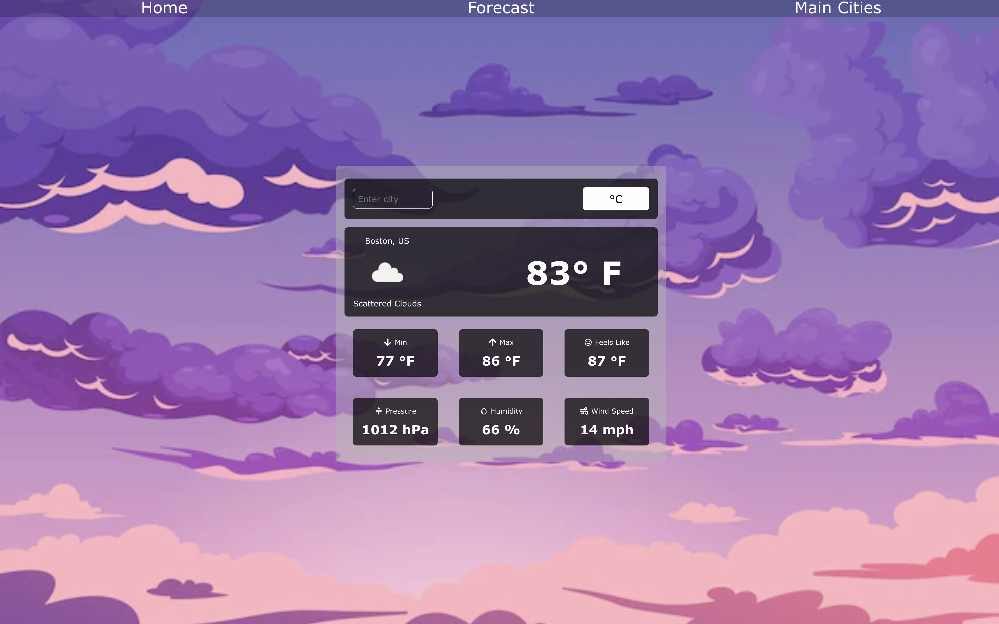
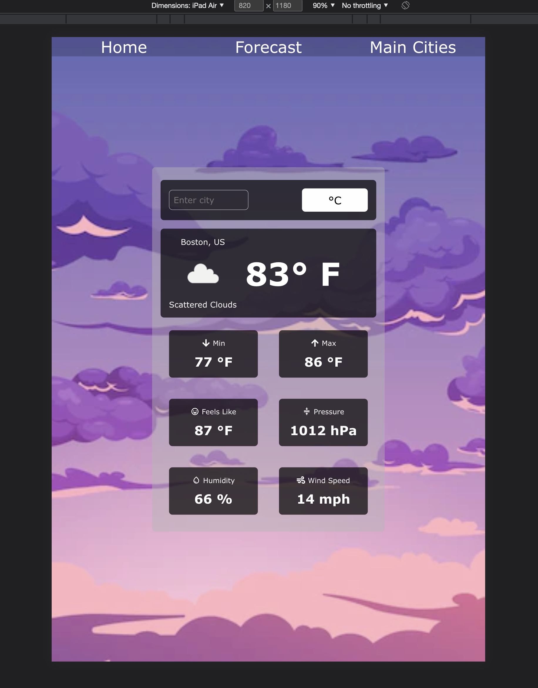
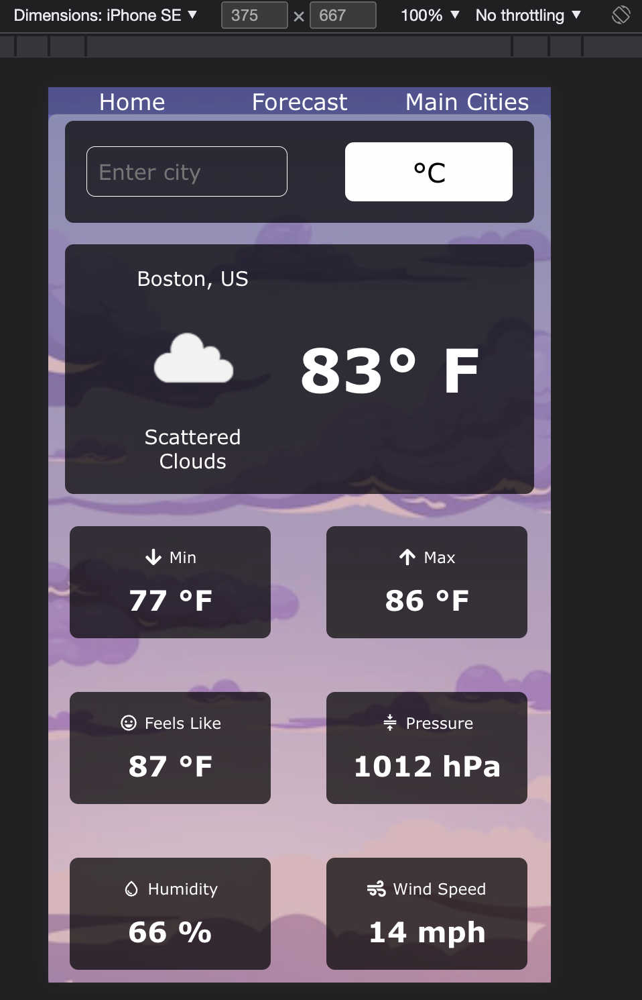
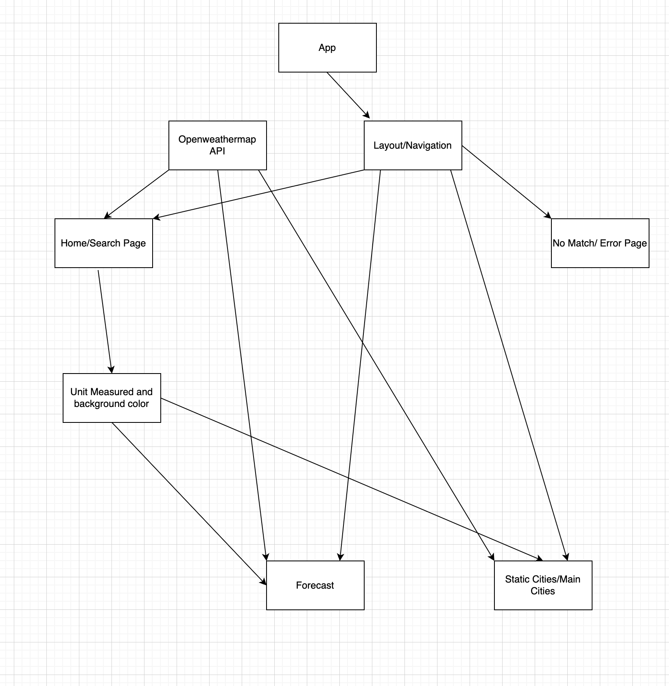

# Weather Application

[Click here to go to the application](https://weather-app-2a1a4b.netlify.app/)

Weather App is a weather application that allows you to search the city that you would like to see the climate of.
Info such as the city's hourly and daily weather, what the weather actually feels like, humidity, and much more.
This application will also allow the user to change fahrenheit to celsius and will convert all the pages to change to the
unit that's desired.

## Desktop View

## iPad View

## iPhone View

## Diagram of how the application runs

## API
- [https://openweathermap.org](https://openweathermap.org/)